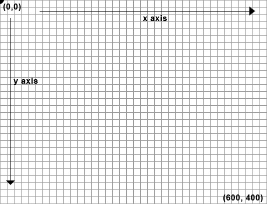

# Draw

## Carteisan vs Canvas Coordiante Systems


### Canvas



## Basic Shape Functions

1. `line(x1, y1, x2, y2)`
1. `triangle(x1, y1, x2, y2, x3, y3)`
1. `quad(x1, y1, x2, y2, x3, y3), x4, y4)`
1. `rect(x, y, width, height)`
1. `ellipse(x, y, diwth, height)`
1. `arc(x, y, width, height, start, stop)`

### Line
1. Draw a line between coordinate (20, 20) and (450, 450).
```javascript
function setup() {
  createCanvas(480, 480);
}

function draw() {
  background(200);
  line(20, 20, 450, 450);
}
```

2. Change the coordinates to be (20, 30) and (450, 200). *What happens to the line?*

```javascript
function setup() {
  createCanvas(480, 480);
}

function draw() {
  background(200);
  line(20, 30, 450, 200);
}
```
### Triangle
3. Draw a triangle with coordinates (240,40), (40, 240), (440, 240).

```javascript
function setup() {
  createCanvas(480, 480);
}

function draw() {
  background(200);
  triangle(240,40, 40, 240, 440, 240);
}
```
### Quadrilateral
4. Draw a quadrilateral with coordinates (30, 160), (100, 30), (390, 300), (350, 410):

```javascript
function setup() {
  createCanvas(480, 480);
}

function draw() {
  background(200);
  quad(30, 160, 100, 30, 390, 300, 350, 410);
  
```
### Rectangle
5. Draw a rectangle with coordinates (80, 190), (300, 60):

```javascript
function setup() {
  createCanvas(480, 480);
}

function draw() {
  background(200);
  rect(80, 190, 300, 60);
}
```

### Arc (Part of an Ellipse)
For this course we will be using  `angleMode(DEGREES)`. This changes all functions that accept angle to use degrees based on twhich parameter is passed in.
6. Follow the example below:

```javascript
function setup() {
  createCanvas(480, 480);
  angleMode(DEGREES)
}

function draw() {
  background(200);
  arc(90, 220, 80, 80, 0, 90);
  arc(190, 220, 80, 80, 0, 270);
  arc(290, 220, 80, 80, 180, 450);
  arc(390, 220, 80, 80, 45, 225);
  
}
```

## Draw Order

If you want a shape to be drawn on top of other shapes, it needs to follow the others in the code. 

```javascript
function setup() {
  createCanvas(480, 480);
}

function draw() {
  background(200);
  ellipse(140, 100, 190, 190);
  rect(130, 100, 260, 20);
}
```

Switch the places of `ellipse` and `rect` and watch them switch places.

```javascript
function setup() {
  createCanvas(480, 480);
}

function draw() {
  background(200);
  rect(130, 100, 260, 20);
  ellipse(140, 100, 190, 190);
}
```

## Stroke Weight

function setup() {
  createCanvas(480, 480);
}

function draw() {
  background(220);
  strokeWeight(2);
  ellipse(75, 220, 90, 90);
  strokeWeight(8);
  ellipse(175, 220, 90, 90);
  ellipse(279, 220, 90, 90);
  strokeWeight(20);
  ellipse(389, 220, 90, 90);
}

## Color

RGB (red, green, and blue) refers to a system for representing the colors to be used on a computer display. Red, green, and blue can be combined in various proportions to obtain any color in the visible spectrum. Levels of R, G, and B can each range from 0 to 100 percent of full intensity. Each level is represented by the range of decimal numbers from 0 to 255

Go to the [RGB Calculator](https://www.w3schools.com/colors/colors_rgb.asp)

AND

Go to the [HTML Color Picker](https://www.w3schools.com/colors/colors_picker.asp)

```javascript
function setup() {
  createCanvas(480, 480);
}

function draw() {
  background(0, 26, 51);
  fill(255, 0, 0);
  ellipse(140, 202, 200, 200);
  fill(0, 255, 0);
  ellipse(228, 114, 200, 200);
  fill(0, 0, 255);
  ellipse(300, 230, 200, 200);

}
```
### Transparency (Alpha)

There is a fourth parameter known as the *alpha* value. It also ranges from 0 to 255 to set the amount of transparency. Where 0 is entirely transparent, the value of 255 is opaque.

```javascript
function setup() {
  createCanvas(480, 480);
  noStroke();
}

function draw() {
  background(150);
  fill(255, 0, 0, 160);
  ellipse(140, 202, 200, 200);
  fill(0, 255, 0, 160);
  ellipse(228, 114, 200, 200);
  fill(0, 0, 255, 160);
  ellipse(300, 230, 200, 200);

}
```

## Coding Challenge

Draw a Robot:

```javascript
function setup() {
  createCanvas(720, 480);
  strokeWeight(2);
  ellipseMode(RADIUS);
}

function draw() {
  background(204);
  //Neck
  stroke(102);
  line(266, 257, 266, 162);
  line(276, 257, 276, 162);
  line(286, 257, 286, 162);
  
  //Antennae
  line(276, 155, 246, 112);
  line(276, 155, 306, 56);
  line(276, 155, 342, 170);
  
  //Body
  noStroke();
  fill(102);
  ellipse(264, 377, 33, 33);
  fill(0);
  rect(219, 257, 90, 120);
  fill(102);
  rect(219, 274, 90,6);
  
  //Head
  fill(0)
  ellipse(276, 155, 45, 45);
  fill(255);
  ellipse(288, 150, 14, 14);
  fill(0);
  ellipse(288, 150, 3, 3);
  fill(153);
  ellipse(263, 148, 5, 5);
  ellipse(296, 130, 4, 4);
  ellipse(305, 162, 3, 3);
  

}
```

Try to Change the color of the robot.
