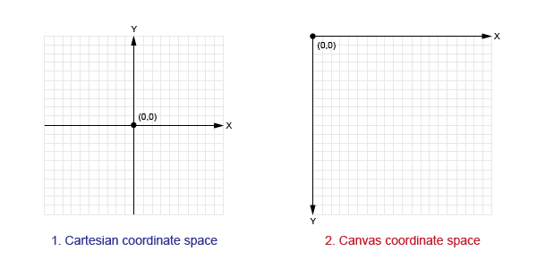

# Draw

## Carteisan vs Canvas Coordiante Systems

### Canvas

## Basic Shape Functions

1. `line(x1, y1, x2, y2)`
1. `triangle(x1, y1, x2, y2, x3, y3)`
1. `quad(x1, y1, x2, y2, x3, y3), x4, y4)`
1. `rect(x, y, width, height)`
1. `ellipse(x, y, diwth, height)`
1. `arc(x, y, width, height, start, stop)`
