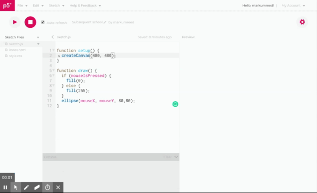

# Make Circles 
- This program creates a graphics canvas that is 480x480 pixels side.

```javascript
function setup() {
  createCanvas(480, 480)
}
```

- It will draw white circles at the position of the mouse.
- When a mouse button in pressed, the cicle color changes to black.

```javascript
function draw() {
if (mouseIsPressed) {
  fill(0);
} else {
  fill(255);
}
 ellipse(mouseX, mouseY, 80, 80);
}
```

Here is a working example of the program:


