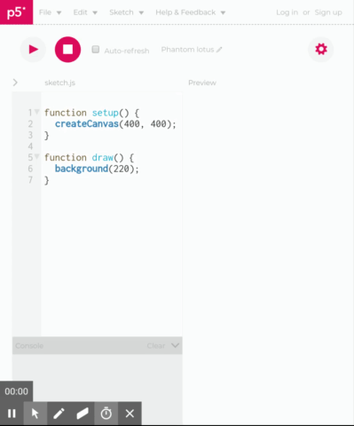
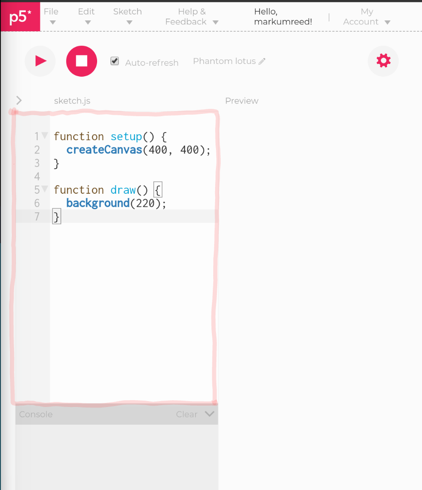
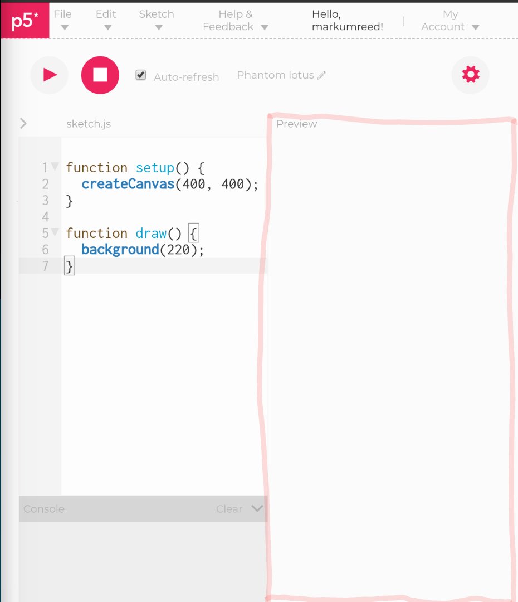
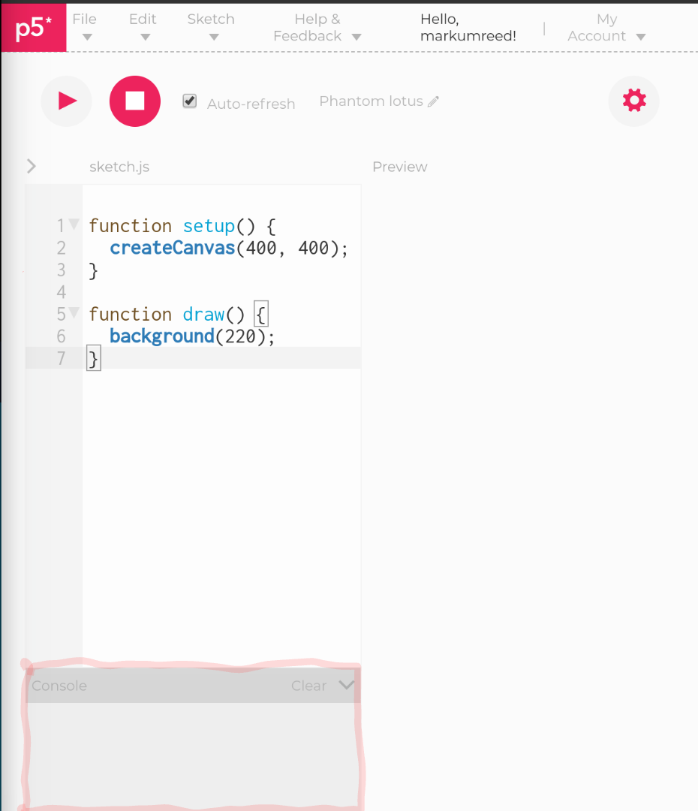
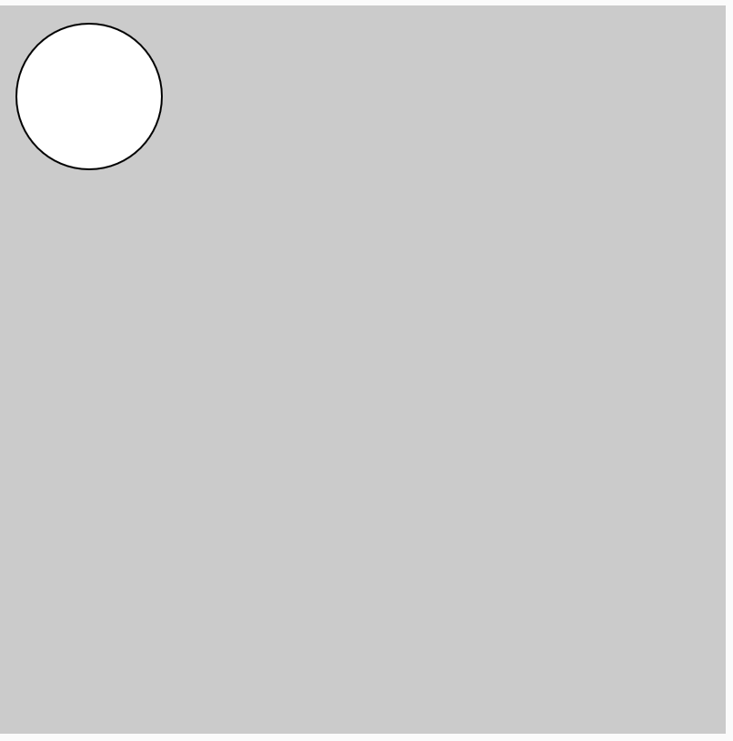

# Getting Started
This course is based on two sources:

1. [McCarthy, L., Reas, C., & Fry, B. (2015). Getting Started with P5. js: Making Interactive Graphics in JavaScript and Processing. Maker Media, Inc..](https://p5js.org/books/)
2. [Code! Programming with p5.js](https://www.youtube.com/playlist?list=PLRqwX-V7Uu6Zy51Q-x9tMWIv9cueOFTFA)

*These are excellent resources for parents and the older students.*

# Introduction

In the course we will be learning [p5.js](https://p5js.org/) which is a [JavaScript](https://en.wikipedia.org/wiki/JavaScript) library. Programming courses usually focus on the stucture and theory first. This is boring and often turns students away from coding. p5.js offers a way for students to learn coding via creating interactive graphics. 

Sketching is a way of thinking that is playful and quick. The goal is to explore many ideas in a short amount of time. Students can start out by sketching on paper them moving the results to code. Ideas for animation and interactions may be sketched with storyboards.

# Homework for August 11, 2019
## p5.js Web Editor

We will be using the [p5.js Web Editor](https://editor.p5js.org/) for the duration of the course. Students are need to have an account setup.

Go to https://editor.p5js.org/ to make an account. 




### Environment

The p5.js Web Editor allows students to code and automatically give students useful feedback. 

There are three primary areas of the environment

1. The Code Editor


2. The Preview Window



3. The Console Window




# Exercises
## Exercise 1 - Draw a circle/ellipse

This is to make sure you understand where to write out come and how to display it.

Follow the instructions below:

1. In the **Code Editor** type the following code:

```javascript
function setup() {
  createCanvas(400, 400);
}

function draw() {
  background(204);
  ellipse(50, 50, 80, 80)
}
```
2. Click the Run/Play Button


3. Check the Preview Window. Does it look like this?



[Next Lesson](introduction/01_make_circles.md)
